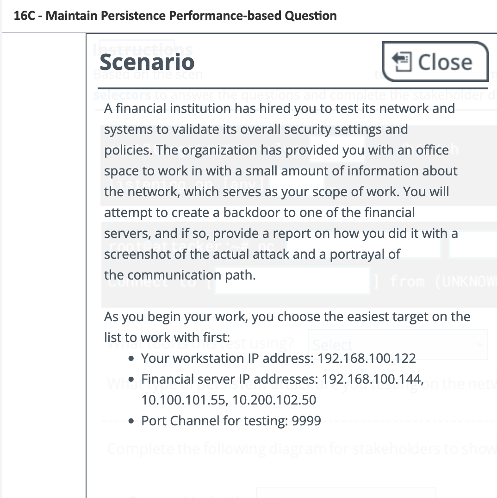
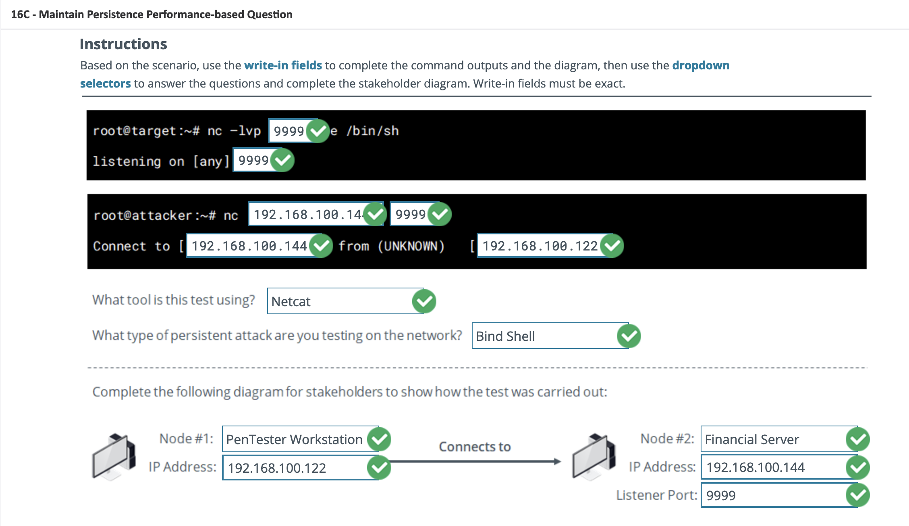
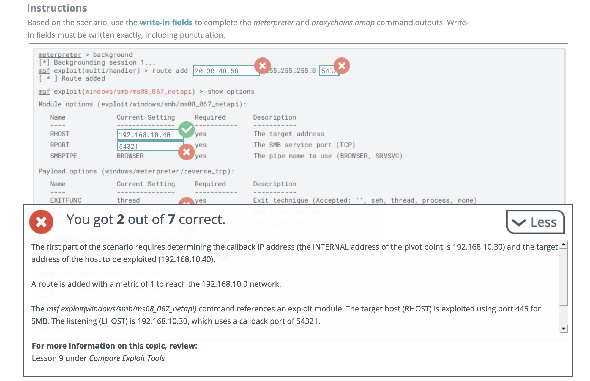
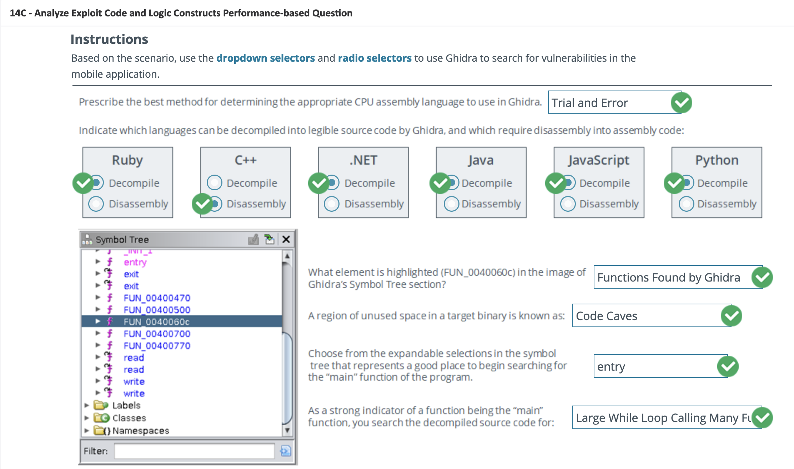
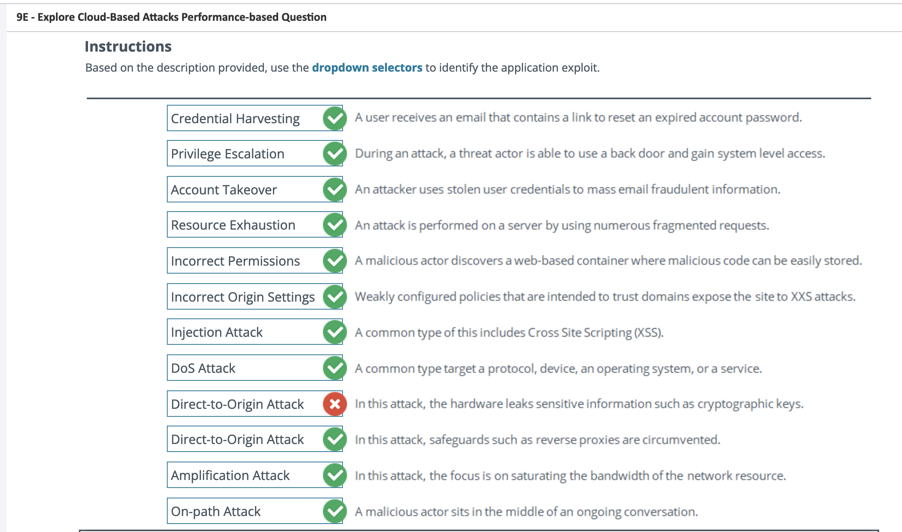
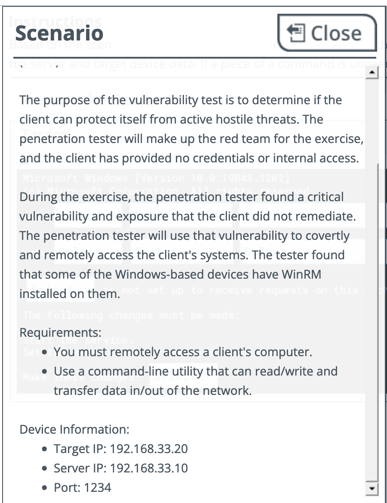
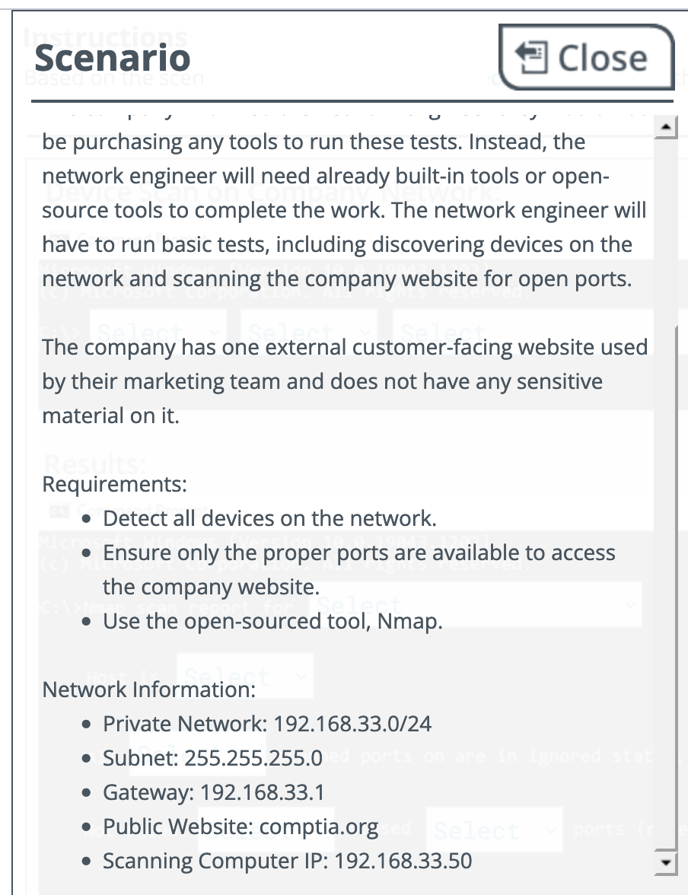
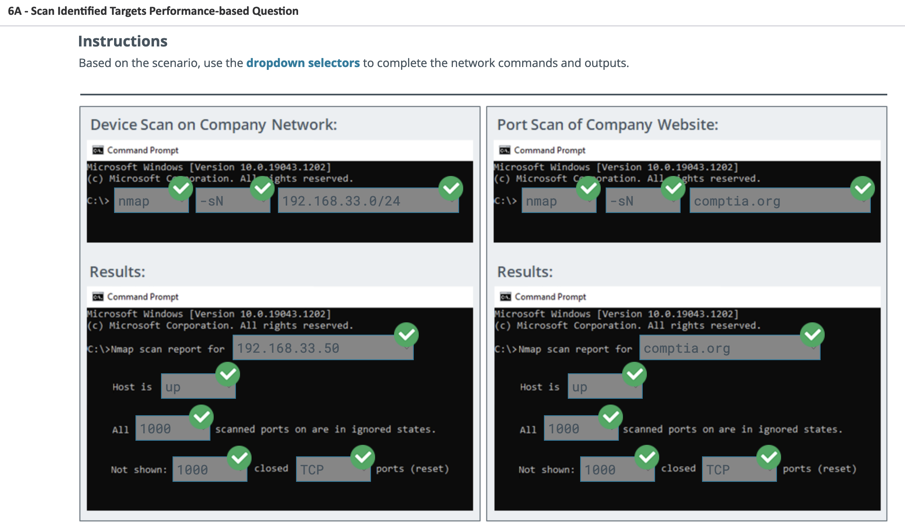
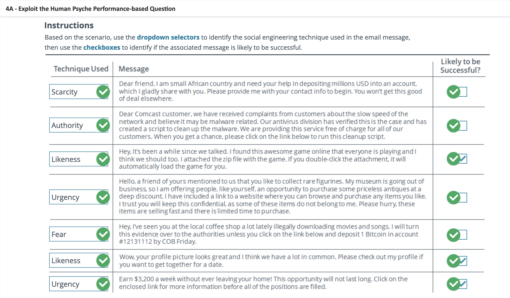
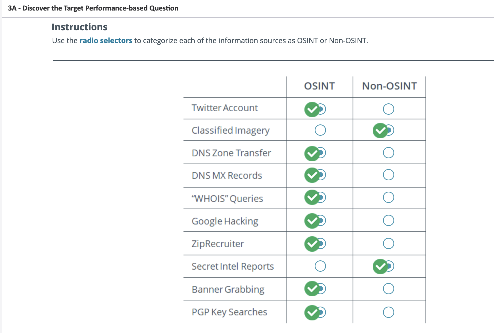

# PenTest Plus - Final Assessment Review

---
### Scenario 1
---

#### Bind Shell - Setup listener on target first





---
### Scenario 2
---


---
### Scenario 3 - Communication Triggers


---


---
### Scenario 4 - Administrative
---


---
### Scenario 5
---



---
### Scenario 6- Wireless
---


---
### Scenario 7 - Cloud Attacks
---

**Note-** a Side-Channel attack leaks cryptograpic keys



---
### Scenario 8 - Covert Channels
---




---
### Senario 9 - NMAP Scanning
---





---
### Scenario 10 - Human Psyche
---



---
### Secanrio 11 - OSINT
---



---
### Scenario 12 - Environmental Considerations
---


### Network Mapping

- **Windows Management Instrumentation (WMI)** - to map and manage a network. WMI can help provide a system inventory that includes system statics and other information.

- **The Simple Network Management Protocol (SNMP)** - is useful for managing many devices including those that are not computer workstations or laptops.

- **The ARP (Address Resolution Protocol)** - command is a useful Windows command-line tool that can provide IP to MAC address mapping information for a host on a network.

### Wireless Attacks

- **Aircrack-ng** - **decipher encryption keys** - is the tool within the Aircrack-ng suite that would be used to attempt to decipher the encryption key of the APs. Aircrack-ng performs key cracking based on collected data, making it a suitable choice for this scenario.

    - It's suite of utilities is made up of several command-line tools used for wireless monitoring, attacking, testing and password cracking.
 
- **Airmon-ng** - **Monitor Mode** -is used to switch wireless network cards into monitor mode, which is a prerequisite for capturing data packets on your network but does not crack encryption keys itself.
 
- **Airodump-ng** - DUMP FRAMES **captuers packets** - **captures Frames** --is used to capture packets from a wireless router. While it's important for the process because it gathers the data that Aircrack-ng will analyze, it doesn't decipher encryption keys on its own. 

    - It's a tool that provides the ability to capture 802.11 frames and then use the output to identify the Basic Service Set ID (MAC address) of an access point
 
- **Aireplay-ng** - **inject frames** - is used to inject frames into wireless networks to generate traffic for later analysis. It is instrumental in certain types of attacks, but the actual cracking of encryption keys is not its function.


---
### Bluetooth
---

- **Bluesnarfing** - **Ability to Read Data** -is an aggressive attack, as a malicious actor is able to read information from a victim's Bluetooth device. Bluesnarfing is ineffective against devices that set Bluetooth in non-discoverable mode.

- **Bluejacking** is a method used by attackers to send out unwanted text messages, images, or videos to a mobile phone, tablet, or laptop using a Bluetooth connection.

- **Postman** - is a tool that provides an interactive and automatic environment used to interact and test an API.

---

### Google Hacking
---
- **link:comptia.org about** - **Link Operator** - <ins>To find a link to a specified page</ins>, the link operator is used. Searching link:comptia.org about will search for pages that link to CompTIA's website and have the text "about" on the page.

- **inanchor:about employees** When searching for anchor text, the inanchor operator is used. Searching inanchor:about employees <ins>will search for pages with the anchor text "about" and with the text "employees" on the page.</ins>

- **inurl:about employees** A URL can be searched for text with the inurl operator. Searching inurl:about employees <ins>will search for pages whose URLs include the text "about" and have the text "employees" on the page.</ins>

- **site:comptia.org about** - To search a site for text, the site operator is used. Searching site:comptia.org would be used to search CompTIA's website for the text "about."

---
### Tools
---
- **Metasploit Framework** is a free open-source command-line version of a popular PenTest tool. By default, it is installed with a fresh install of the popular Kali Linux image.

- **Armitage** is an intuitive **third-party GUI for the Metasploit framework.** This add-on provides the ability to avoid using the utility with command-line commands.

- **Cobalt Strike is a third-party commercial version of Armitage.** Unlike Armitage, it includes many advanced features and detailed reporting is included.

- **Metasploit Pro** is a full-featured graphical version that includes Quick Start wizards, easy vulnerability scanning and validation, phishing campaigns, and reporting. **

- **Gobuster** can discover subdomains, directories, and files by brute-forcing from a list of common names. This can provide information that was otherwise not available.

- **Wapiti** is a web application vulnerability scanner that will automatically navigate a web app looking for areas where it can inject data.

- **TruffleHog** is a Git secrets search tool. It can automatically crawl through a repository looking for accidental commits of **secrets**.

- **BeEF (Browser Exploit Framework)** focuses on **web browser attacks** by assessing the actual security posture of a target by using client-side attack vectors.

- **Mimikatz** - can be used to gather credentials by extracting key elements from memory such as cleartext passwords, hashes, and PIN codes.

- **Medusa** - is a parallel brute-forcer for network logins. Its focus is to support numerous network services that allow remote authentication.

- **Brutespray** allows for the interpretation of results from an Nmap scan to automatically start medusa against the identified open ports. It can also use results from nmap with option "-sV" to identify and target services on non-standard ports.

- **Hydra** - tool is brute force tool similar to medusa, in that it supports parallel testing of several network authentications. It comes bundled with a tool called pw-inspect.


---
### NMAP Basics

A defaul NMAP Scan Does This:
- **Address Resolution Protocol (ARP)** requests are sent to hosts to obtain Media Access Control (MAC) address details. The MAC address can be used for purposes such as access control.

- **ICMP type 13** By default, a Nmap scan will use the timestamp, which is provided message for ICMP type 13, of 32 bits of milliseconds since midnight UT during host discovery.

### NMAP Commands
---
- ```-O ``` - OS Detection

- ```-sV ``` - **Banner Grabbigng** - Version Detection. It performs version detection on the open ports that are found. In its simple form, this process is generally known as banner grabbing.

- ```-sY``` An SCTP Initiation Ping uses the Stream Control Transmission Protocol (SCTP), an alternative to using either a TCP or UDP scan to see if a host is alive. This scan requires using the -sY option.

- ```-sV --script vulners``` scan automation to find vulnerabilities using built in scripts 

- ```nmap ipaddress``` By default, Nmap will perform a TCP scan. 

- ```TCP SYN (synchronize)``` Default action- packet starts a communication session with a host by using TCP to initiate a conversation. 

- ```-PU``` A UDP protocol scan can be initiated by using the -PU for port scanning.

- ```-sS``` Stealth Scan
    - A stealth scan uses techniques that try to exploit the expected behavior of TCP. When used alone, the scans may have limited effectiveness. Using other scans in conjunction can fill in the gaps of information.
    
    - A stealth scan in noncredentialed that uses fewer permissions, and many times can only find missing patches or updates.

#### NMAP Responses

- **Open** - Nmap reports that a port is open by making a valid connection to the system and to the port itself. When open, the system responds to any probes.

- **Closed** - When a port is closed, probes reach the system but the port itself is not reachable.

- **Filtered** filtered port is reported by Nmap when it is concluded that the port is being blocked by a firewall.

- **Unfiltered** - An unfiltered port is reported when the system and the port are accessible, however, Nmap is unable to determine if the port is open or closed.


#### Timing Commands

- **T0/T1** - Slow scans, IDS evasion, rate limiting. 
    -  T0 = paranoid scan

- **T2** - last to use serial scanning. faster than T0 and T1

- **T3** - Default timing setting

- **T4** - Fast scan, relatively stable

- **T5** - Fasted option but unstable. Should only beused on network that can handle the speed.

#### Trafic Visibility

- **Port monitoring** - To capture all traffic on a switch port, port monitoring can be used. This typically required logging into the switch and enabling monitoring.

- **Switched port analysis (SPAN)** - To capture all traffic on a switch, an option is to use switched port analysis (SPAN). With SPAN, all ingress and egress traffic is copied between ports. This is also referred to as mirroring.

- **Promiscuous mode** - is required when trying to monitor all traffic on a network. Without this mode enabled, sniffing will not pick up all network traffic.


#### Ports

- **SMB** - ```139 or 445```
- **LDAP** - ```389``` Active Directory
- **RPC** - ```111```
- **NETBIOS** - ```445```

### Packet Crafting

- **Decoding** - the capture of the packets sent will help to determine how the test went. The Pentester can analyze traffic generated using a packet analyzer such as Wireshark.

- **Editing** a packet is similar to assembling a packet. The difference is that the packet content is modified after it was created or captured.

- **Assembling** - a packet involves the creation of the packet to be sent. This may involve setting malformed information to see how the traffic is handled by certain devices on a network.

- **Playing** in the packet crafting process is the actual release of the packet into the wild. The packet is sent or resent (if edited) on the network.


Lesson 7

---

### Engagement Related

---
- **Master Service Agreement** 
    - **Insurance** - Conducting a PenTest for an organization is a business arrangement, and all terms of the test should be clearly defined. Any general and liability insurance should be outlined if something goes wrong and damages occur.

    - **Safety guidelines and environmental concerns** - should be part of a master service agreement. Such guidelines should outline prohibited areas and the use of the facility.

    - **Project scope** - is defined within the master service agreement. The project scope is a definition of the specific work that is to be performed and completed.

- **Reconnaissance** focuses on gathering as much information about the target as possible. This process includes searching information on the Internet, using Open-Source Information Gathering Tools (OSINT).

- **Scanning** is a critical phase as it provides more information about available network resources. Scanning identifies live hosts, listening ports, and more.

- **Lessons Learned** - **New Vulns** - It is possible that the team found new unknown vulnerabilities during the testing. Additional personnel training or updated tools may be part of a lessons learned report.

- **Client follow-up** - is not part of a lessons learned report but rather a revisit to a client after testing and mitigation techniques have been implemented.

- **Mitigation implementation** - Although a Pentest team may assist, a mitigation implementation is the responsibility of the client and is not part of a lesson learned.

- **Client Acceptance** - During the formal hand-off process, confirmation from the client that they agree that the testing is complete and that they accept your findings as presented is important. This is not part of a lessons learned report.

- **Analysis** occurs after a team has completed an exercise. A collection of the results of all activities are analyzed, and a summary is derived of the risk ratings for each.

- **Reporting** - will deliver the results and any remediation suggestions to the stakeholders, along with a realistic timeline of reducing risk and implementing corrective actions.

#### In Scope

- **Users** are an in-scope asset, as they are susceptible to social engineering, and are generally considered to be the easiest attack vector.

- **Domains and/or subdomains** within the organization are a prime target for malicious activity and are an in-scope asset. Domains and subdomains are examples such as example.com and ftp.example.com.

- **Service Set Identifiers (SSID)** can be targeted when an attacker is attempting to access a wireless network. As such, they are an in-scope asset.

#### Typically not in scope

- **Password** Passwords are dynamic in nature and can be reset at any time. The systems that provide and require the passwords would be an in-scope asset.

#### Engagement Scope/Risk

- **Risk appetite**- refers to the amount and type of potential vulnerabilities and threats the organization is willing to tolerate and endure.

- **Metrics** are quantifiable measurements of the status of results or processes. An example of a metric related to PenTesting is the criticality of vulnerability findings.

- **Measures** - are the specific data points that contribute to a metric. Values may be a percentage of systems that are susceptible to a particular vulnerability.

- **Risk rating** - is the process of assigning quantitative values to the identified risks. This is usually done by following a reference framework.

- In the United States, export controls regulate the transfer of certain services outside of the country. For example, Wireshark is a powerful open-source protocol analysis tool that falls under the U.S. encryption export regulations, and it may be illegal to use in certain countries.

#### Reporting Control Types - Post Engagement

- **Administrative controls** - are security measures implemented to monitor the adherence to organizational policies and procedures.

- **Logical controls** - automate protection to prevent unauthorized access or misuse. An example of this includes an Access Control List (ACL) that may be implemented as software or hardware.

- **Physical controls** - restrict, detect and monitor access to specific physical areas or assets. Methods may include barriers, tokens, biometrics, or other controls.

- **Technical controls** - may include Intrusion Detection System (IDS)/Intrusion Prevention System (IPS) signatures and antimalware protection. These are implemented as system hardware, software, or firmware solutions. 

### SQL Injection

---

- **SingleApostrophe** - ***```'```*** The most common method for identifying possible SQL injection vulnerabilities in a web app is to submit a single apostrophe and then look for errors. This is called the single quote method. If an error is returned, it may provide SQL syntax details.

- Certain web app APIs also allow the stacking of multiple queries within the same call. This can be useful for injecting new query types into a form's existing query type.

**Blind SQL injectio**n is injecting SQL when the web application's response does not contain the result of the query.

- Adding a time delay to a Blind SQL injection is known as time-based blind SQLi.

---

### PCI Compliance

---

**<ins>PCI DSS mandates a RoC</ins>**

- **Level 1** - merchants process over **6 million transactions annually**, which categorizes them as high-risk. The  for these merchants, requiring a formal assessment by a Qualified Security Assessor (QSA) due to the high volume of transactions.
 
- **Level 2** - merchants process 1 to 6 million transactions annually and typically complete a Self-Assessment Questionnaire (SAQ), but an acquiring bank may require an audit and ROC.
 
**<ins>No RoC Required</ins>**

- **Level 3** - merchants process 20,000 to 1 million transactions annually. They are not required to complete a RoC and typically do not choose this option.
 
- **Level 4** - merchants process fewer than 20,000 e-commerce transactions annually. They are low-risk and do not complete a RoC for PCI DSS compliance.

---

### Netcat Commands

---

#### Create Pessistent Listener

- ```-L``` option starts Netcat in the Windows-only "listen harder" mode. This mode creates a persistent listener that starts listening again when the client disconnects.

- ```-p``` option specifies the port that Netcat should start listening on in listening mode. When used in client mode, this value specifies the source port.

- ```-e``` option specifies the program to execute when a connection is made. This is useful for alerts and logging.

#### Non-persistent

- ```-l``` option starts Netcat in listen mode. This is a non-persistent mode. The default mode without this option is to act as a client.
---
### Steganography 
---
Used for files that contain a payload

- **Carrier** - must be able to pass as the original and appear harmless. A carrier might be music or an image file.

- **Payload** - can contain any number of things, such as trade secrets or command and control activity. Once the payload is hidden, no one outside of the sender and the receiver should suspect anything.

- **Tools** many tools are available that can conceal the activity. Most are freely available and have similar functions in that they can conceal and encrypt data using a wide range of carriers.

---

### Scripts

---

- **Pseudocode** is a made-up language used to show flow and logic but is not based on any programming or scripting language. Pseudocode can be used to easily illustrate the logic of a script.

- **Operators** - are used in code to perform calculations such as mathematical calculations.

- **A tree**  has the root at the top, and the "branches" go down, with a "leaf" object at the end of a branch.

- **Flow Control** - Controlling the flow of instructions (flow control) enables programmers to write a script so that it can follow one or more paths based on certain circumstances.

#### Bash

- **When using Bash for scripting in Linux, a variable is not designated with a leading $. A leading $ is required when using PowerShell in a Windows environment.

    -  ```my_str="Password"  ``` - BASH
    - ```$my_str = "Password"  ``` - Powershell

When scripting in Bash, there is strict use of the equals sign (=). In Bash, the equals sign must not have a leading or trailing space, also known as whitespace.

The use of the underscore character (_) is not restricted in Bash when using it as part of a variable name.

---
### Windows 
---

- **Distributed Component Object Model (DCOM)** -The Remote Procedure Call (RPC) enables inter-process communications between local and remote systems. DCOM applications use RPC as a transport mechanism. The intent is to exploit a flaw in the Distributed Component Object Model (DCOM) during the move.

- **PsExec utility** - **SMB** - uses the Server Message Block (SMB) protocol to enable the issuing of commands to a remote system across a network.

- **WinRM** - **SOAP** -Windows Remote Management (WinRM) is a technology that provides an HTTP Simple Object Access Protocol (SOAP) standard for specific remote management services on Windows systems.

- **RDP** - remote desktop protocol (RDP) is the default remote desktop service that comes with Windows systems. It does not use RPC with DCOM.

---
### Vulnerability Lifecycle  Phases

- 1.**Discover phase** - is the first step in finding a potential vulnerability that can be exploited.

- **Coordinate phase** - occurs after discovering a vulnerability. During this phase, the vulnerability is defined, listed, and published.

- **Manage phase** - is where the patch has been released. As such, the next step is to apply the patch in order to remediate or mitigate the vulnerability.

- **Document phase** - is the final phase. In this phase, the vulnerability patch has been tested, and all involved will take a moment to document what has been done. In addition, it's best to reflect on lessons learned, in order to prevent further exposure.
 
### Voice Over IP

- **SIP Protocol** at application layer
    - Port 5060  
    - A SIP INVITE cause a ring on the target endpoint and transfers caller ID data. 

- **UDP or TCP** at transport layer

#### Tools that can Spoof caller iD data:

- Inviteflood
- Viproy
- Twillo
- SIPp-DD

** SMPT2GO is an email serving API

Reference- Lesson 4

---
### Password Sanitation
---

- **Salt** - **added before hashing** A randomly generated string, known as a salt, can be added to a password before hashing. This salt can be stored along with the hashed password for verification purposes.

- **Hashing** - is a method that is used to encrypt passwords. A hashing algorithm takes a given value (password) and converts it into another value.

- **Password encryption** - uses one of a number of algorithms for protection. Otherwise, a password would be visible as clear text when transmitted across a network.
 
### DNS 

- **Recursion** - **queries results from other servers** -  **not reliable or safe** A DNS server that allows recursion and is incorrectly configured might be more exposed to unauthorized updates because it's designed to query and cache results from other servers. It could be tricked into caching and then serving unauthorized updates if it's not well-secured.
 
- **Poisoned cache** - **response to queries** - is a security concern, it is not directly related to the server's response to dynamic updates. Poisoning affects the server's response to queries, not its policy on accepting updates.
 
- **Invalid Records** - If a DNS server contains invalid records, it suggests a problem has occurred, such as incorrect manual entries or a successful attack on the server (like cache poisoning).
 
- **Authoritative** - Being authoritative does not imply a lack of authentication for dynamic updates; it's a separate aspect of DNS server behavior. An authoritative server, just like any other, should be configured to authenticate dynamic updates properly to maintain security.